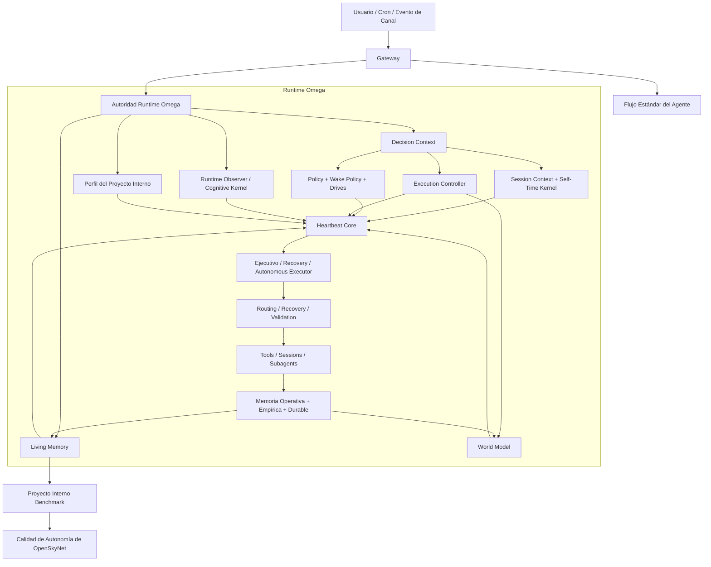

# OpenSkyNet


_Lee la versión por defecto en [English](README.md)._

**OpenSkyNet** es una evolución empírica y orientada a la autonomía de [OpenClaw](https://github.com/openclaw/openclaw).

No está planteado como otro contenedor de "chat con herramientas". La meta central es convertir el runtime del asistente en algo más sólido entre sesiones: mejor continuidad de estado, mejor recuperación tras fallos, mejor routing y mejor trabajo autónomo de largo plazo.

## Estado Experimental

Este repositorio es **experimental**.

Está pensado para:

- funcionalidad de frontera
- investigación en autonomía
- experimentación sobre el runtime
- exploración de Brain Lab en [`src/skynet`](./src/skynet)

No está planteado como objetivo de despliegue productivo.

Expectativa práctica:

- la funcionalidad y la iteración empírica tienen prioridad sobre el hardening productivo
- la arquitectura puede cambiar de forma agresiva
- los subsistemas experimentales pueden estar incompletos, ser inestables o seguir deliberadamente ásperos
- si alguien lo despliega en un entorno sensible, esa decisión corre por su cuenta, no por una promesa del proyecto

## Repositorio

El desarrollo activo ocurre en:
[github.com/skynet-omega/openskynet](https://github.com/skynet-omega/openskynet)

Mirrors públicos y contacto:

- GitHub: [github.com/skynet-omega/openskynet](https://github.com/skynet-omega/openskynet)
- Mirror en Hugging Face: [huggingface.co/Darochin/openskynet](https://huggingface.co/Darochin/openskynet)
- Contacto: [gonzalo_daroch@hotmail.com](mailto:gonzalo_daroch@hotmail.com)

## Dirección Actual

OpenSkyNet debe leerse hoy como dos líneas explícitas de trabajo:

- **OpenSkyNet**: la plataforma misma. Incluye gateway, sesiones, herramientas, canales, cron, UI y el spine runtime de `Omega` para memoria, routing, recuperación y control ejecutivo.
- **Skynet Brain Lab**: la línea de investigación separada en [`src/skynet`](./src/skynet) para buscar un sustrato cognitivo nuevo más allá del agente centrado en LLM.

También existe una carga de trabajo autónoma configurable mediante [`INTERNAL_PROJECT.json`](./INTERNAL_PROJECT.json). Por defecto ese proyecto es `Skynet`, pero ese archivo define un benchmark interno de la plataforma, no la identidad completa del repositorio.

Regla práctica:

- si la meta es calidad del runtime, autonomía, recuperación, observabilidad o menor desperdicio, el trabajo va en `OpenSkyNet`
- si la meta es un cerebro nuevo, un sustrato nuevo, cuantización geométrica, cognición bifásica/cyborg o una arquitectura generalista distinta al stack actual, el trabajo va en `Skynet Brain Lab`
- sólo deben promoverse mecanismos del lab a la plataforma después de validación empírica y revisión explícita de costo/beneficio

Prioridad actual del repo:

- `OpenSkyNet` ya está lo bastante estable como para pausar casi todo el trabajo arquitectónico ahí
- sólo bugs operativos o de continuidad justifican tocar la plataforma ahora
- la exploración activa debe moverse a `Skynet Brain Lab`

El benchmark práctico es este:

- si OpenSkyNet puede sostener trabajo autónomo útil sobre un proyecto interno a lo largo del tiempo, entonces está mejorando como agente frente al runtime padre
- si no puede, todavía le falta arquitectura

## Omega Hoy

`Omega` ya no es sólo un nombre para experimentos vagos de cognición. Hoy tiene responsabilidades concretas del runtime en [`src/omega`](./src/omega):

- [`runtime-authority.ts`](./src/omega/runtime-authority.ts): fusiona señales de estado presente en una autoridad común usada por heartbeat, trabajo ejecutivo y autonomía.
- [`living-memory.ts`](./src/omega/living-memory.ts) y [`living-memory-events.ts`](./src/omega/living-memory-events.ts): mantienen estado presente estructurado e historial durable de eventos en `.openskynet/living-memory/`.
- [`world-model.ts`](./src/omega/world-model.ts): deriva presión de routing, localidad, preferencia de recuperación, presión del proyecto interno y contexto ejecutivo desde el estado actual.
- [`session-context.ts`](./src/omega/session-context.ts): mantiene coherentes timeline, validación, self-time kernel y outcomes de sesión entre turnos.
- [`execution-controller.ts`](./src/omega/execution-controller.ts): decide control correctivo y postura de recuperación en vez de dejar el manejo de fallos como pegamento de prompts.
- [`heartbeat-core.ts`](./src/omega/heartbeat-core.ts): centraliza razonamiento de wake, carga de autoridad runtime, framing correctivo y lógica ejecutiva de heartbeat.
- [`frontal/wake-policy.ts`](./src/omega/frontal/wake-policy.ts): prioriza trabajo interrumpido o activo por encima de limpieza de goals stale.
- [`inner-life/drives.ts`](./src/omega/inner-life/drives.ts): resuelve presión motivacional persistente con selección contextual de drives en vez de ranking bruto por error.
- [`sparse-metabolism.ts`](./src/omega/sparse-metabolism.ts) y [`jepa-drive-enhancement.ts`](./src/omega/jepa-drive-enhancement.ts): añaden gating más liviano y sensible a sorpresa para despertar componentes caros sólo cuando conviene.
- [`cognitive-kernel.ts`](./src/omega/cognitive-kernel.ts): carga artefactos del lab sólo como `soft prior` con compuertas explícitas, no como reemplazo soberano del runtime.

El trabajo reciente también movió piezas no críticas o demasiado teóricas fuera del hot path hacia [`src/omega/experimental`](./src/omega/experimental), dejando el runtime más claro que en iteraciones anteriores.

## Para Qué Existe `src/skynet/experiments`

[`src/skynet/experiments`](./src/skynet/experiments) es el laboratorio activo de **Skynet Brain Lab**.

Su propósito no es llenar la plataforma de código especulativo. Existe para:

- probar nuevos sustratos cognitivos, arquitecturas no tradicionales e hipótesis físicas/geométricas fuera del runtime estable
- correr benchmarks falsables antes de promover cualquier mecanismo a `OpenSkyNet` u `Omega`
- conservar líneas históricas de arquitectura como `V28`, `V67`, `V77` y otros prototipos sin forzarlas a producción
- separar con claridad dos preguntas:
  - "¿esta idea crea un mejor cerebro?"
  - "¿esta idea mejora el runtime productivo?"

Regla práctica:

- si un experimento sigue en `src/skynet/experiments`, todavía es investigación
- si un mecanismo sobrevive revisión empírica y análisis explícito de costo/beneficio, recién entonces debería transferirse a la plataforma

## Qué Lo Diferencia de OpenClaw

OpenClaw sigue siendo la plataforma base y aporta mucho del plumbing esencial. OpenSkyNet se distancia del padre en estas zonas:

- **Memoria viva estructurada**: el estado presente ya no debería salir solo de diarios planos. El runtime vive en `.openskynet/living-memory/` y stores estructurados relacionados.
- **Soberanía de runtime**: `heartbeat`, `omega_work` y la ejecución autónoma están convergiendo hacia una autoridad común en vez de reconstruir contexto por separado.
- **Énfasis en decisión y recuperación**: Omega modela de forma explícita recuperación, preferencias de routing, world state y presión de mantenimiento.
- **Spine Omega concreto**: memoria viva, world model, wake policy, selección de drives, metabolismo, control correctivo y recuperación ejecutiva ya existen como módulos explícitos, no como una sola masa conversacional.
- **Línea interna de investigación**: el benchmark/lab `Skynet` incluye probes de bifurcación, cosecha de episodios causales y otros loops experimentales sin volverlos obligatorios para el runtime central de la plataforma.
- **Proyecto interno benchmark**: el sistema puede trabajar en un proyecto configurable durante ciclos libres, y ese proyecto funciona además como benchmark empírico de autonomía.
- **Postura empírica**: la arquitectura intenta mantenerse atada a tests, snapshots de estado, logs y comportamiento medible, no solo a narrativa.

## Snapshot de Arquitectura

Este diagrama resume la forma actual del runtime. Es una guía, no la fuente legal exacta. La corrección importante frente a diagramas viejos es que `Omega` ya no es sólo "Decision Context -> World Model -> Execution". El spine real hoy pasa por `runtime-authority`, `decision-context`, `policy`, `living-memory`, `world-model`, `execution-controller` y `heartbeat-core`.

Para comportamiento preciso, revisa [`src/omega`](./src/omega), [`src/skynet`](./src/skynet), los tests y `docs/architecture/`.



## Instalación

Requisitos:

- Node.js `22+`
- `pnpm`

Clonar desde GitHub:

```bash
git clone https://github.com/skynet-omega/openskynet.git
cd openskynet
pnpm install
pnpm build
```

O clonar desde el mirror en Hugging Face:

```bash
git clone https://huggingface.co/Darochin/openskynet
cd openskynet
pnpm install
pnpm build
```

Notas:

- Una instalación limpia funciona con Node `22.22.1+` y `pnpm 10.23.0+`.
- GitHub es el remoto principal de desarrollo. El repo en Hugging Face funciona como mirror público para descarga y respaldo.
- Algunas integraciones nativas opcionales usan `pnpm approve-builds` en instalaciones nuevas. Si piensas usar TensorFlow con GPU, audio nativo u otros add-ons nativos, ejecuta:

```bash
pnpm approve-builds
```

- La CLI base, gateway, UI, sesiones, canales y el flujo estándar del agente instalan y compilan sin parches manuales extra.

## Primer Arranque Útil

Bootstrap mínimo local:

```bash
pnpm install
pnpm build
./openskynet.mjs setup
./openskynet.mjs configure
./openskynet.mjs dashboard --no-open
```

Después puedes entrar por cualquiera de estas rutas normales:

- `pnpm gateway:dev` para desarrollo local
- `pnpm tui` para la interfaz de terminal
- `./openskynet.mjs agent ...` para corridas directas del agente
- `./openskynet.mjs daemon restart` tras un build estilo producción

Si quieres una ruta un poco más guiada, revisa [`docs/start/QUICKSTART.md`](./docs/start/QUICKSTART.md).

## Ejecución

Desarrollo:

```bash
pnpm gateway:dev
pnpm ui:dev
```

Interfaz de terminal:

```bash
pnpm tui
```

Build local estilo producción:

```bash
pnpm build
openskynet daemon restart
```

## Proyecto Interno Benchmark

OpenSkyNet puede mantener un proyecto interno configurable como trabajo autónomo en tiempo libre. El archivo por defecto es [`INTERNAL_PROJECT.json`](./INTERNAL_PROJECT.json).

Ese proyecto puede ser:

- investigación en IA
- diseño de proteínas
- software de arquitectura
- cualquier otra carga de trabajo persistente que el usuario quiera

En este repositorio el default es `Skynet`, pero la plataforma no debería depender de ese nombre para ser útil.

## Observabilidad

Referencias operativas importantes:

- [`docs/OPERABILIDAD_Y_LOGS.md`](./docs/OPERABILIDAD_Y_LOGS.md)
- `.openskynet/living-memory/`
- `~/.openskynet/agents/*/sessions/`
- `~/.openskynet/cron/`
- `/tmp/openclaw/openclaw-YYYY-MM-DD.log`

## Estado del Proyecto

El repo ya superó la base de "chatbot con tools", pero todavía no está cerrado. El trabajo crítico ahora ya no es limpieza cosmética; es:

- consolidar la soberanía del runtime en Omega
- mejorar la calidad de decisión autónoma
- endurecer la autoridad de memoria
- medir si OpenSkyNet realmente supera a OpenClaw en trabajo autónomo de largo plazo

Ver:

- [`docs/architecture/LIMITACIONES_CRITICAS_OPENSKYNET_2026-03-26.md`](./docs/architecture/LIMITACIONES_CRITICAS_OPENSKYNET_2026-03-26.md)
- [`docs/architecture/OPENCLAW_VS_OPENSKYNET_2026-03-26.md`](./docs/architecture/OPENCLAW_VS_OPENSKYNET_2026-03-26.md)

## Qué Debe Esperar Un Usuario Nuevo

OpenSkyNet ya se puede compartir, pero sigue siendo un proyecto técnico:

- Instalar y compilar es directo para alguien cómodo con Node/pnpm.
- El runtime es grande y muy configurable; no es un juguete de “un comando y listo”.
- Parte de la documentación y referencias internas todavía reflejan la herencia del proyecto padre.
- Los subsistemas experimentales `Omega` y `Skynet` vienen incluidos, pero la plataforma se puede usar sin activar todas las rutas experimentales.

Si tu meta es evaluarlo, empieza por gateway, dashboard, TUI y un solo canal. Agrega GPU, TTS, browser control o cognición experimental solo cuando realmente lo necesites.

## Mirrors Y Soporte

Si quieres el historial canónico de desarrollo, issues y flujo de revisión, usa GitHub:

- [github.com/skynet-omega/openskynet](https://github.com/skynet-omega/openskynet)

Si quieres un mirror público para descarga directa o respaldo, usa Hugging Face:

- [huggingface.co/Darochin/openskynet](https://huggingface.co/Darochin/openskynet)

Para contacto directo:

- [gonzalo_daroch@hotmail.com](mailto:gonzalo_daroch@hotmail.com)

## Agradecimientos

- Autor: Gonzalo Daroch I.
- Plataforma padre: [OpenClaw](https://openclaw.ai/)

OpenSkyNet existe para movernos desde asistencia reactiva hacia trabajo científico e ingenieril autónomo y medible.
