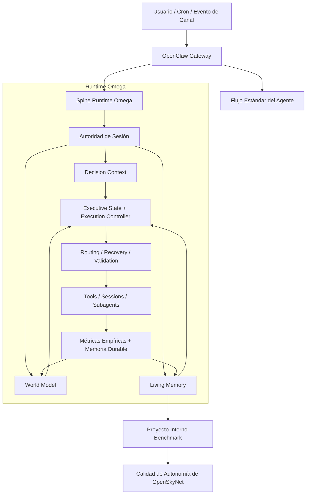

# OpenSkyNet


_Lee la versión por defecto en [English](README.md)._

**OpenSkyNet** es una evolución empírica y orientada a la autonomía de [OpenClaw](https://github.com/openclaw/openclaw).

No está planteado como otro contenedor de "chat con herramientas". La meta central es convertir el runtime del asistente en algo más sólido entre sesiones: mejor continuidad de estado, mejor recuperación tras fallos, mejor routing y mejor trabajo autónomo de largo plazo.

## Repositorio

El desarrollo activo ocurre en:
[github.com/skynet-omega/openskynet](https://github.com/skynet-omega/openskynet)

## Dirección Actual

OpenSkyNet hoy tiene tres capas separadas con bastante más claridad:

- **Gateway / plataforma agente**: canales, sesiones, herramientas, cron, UI y la base operativa heredada de OpenClaw.
- **Runtime Omega**: el spine experimental principal para contexto de decisión, recuperación, routing, despacho ejecutivo, world model y memoria estructurada.
- **Proyecto interno benchmark**: una carga de trabajo autónoma configurable mediante [INTERNAL_PROJECT.json](/home/daroch/openskynet/INTERNAL_PROJECT.json). Por defecto ese proyecto es `Skynet`, pero no es la identidad de OpenSkyNet y puede reemplazarse por otro dominio.

El benchmark práctico es este:

- si OpenSkyNet puede sostener trabajo autónomo útil sobre un proyecto interno a lo largo del tiempo, entonces está mejorando como agente frente al runtime padre
- si no puede, todavía le falta arquitectura

## Qué Lo Diferencia de OpenClaw

OpenClaw sigue siendo la plataforma base y aporta mucho del plumbing esencial. OpenSkyNet se distancia del padre en estas zonas:

- **Memoria viva estructurada**: el estado presente ya no debería salir solo de diarios planos. El runtime vive en `.openskynet/living-memory/` y stores estructurados relacionados.
- **Soberanía de runtime**: `heartbeat`, `omega_work` y la ejecución autónoma están convergiendo hacia una autoridad común en vez de reconstruir contexto por separado.
- **Énfasis en decisión y recuperación**: Omega modela de forma explícita recuperación, preferencias de routing, world state y presión de mantenimiento.
- **Proyecto interno benchmark**: el sistema puede trabajar en un proyecto configurable durante ciclos libres, y ese proyecto funciona además como benchmark empírico de autonomía.
- **Postura empírica**: la arquitectura intenta mantenerse atada a tests, snapshots de estado, logs y comportamiento medible, no solo a narrativa.

## Snapshot de Arquitectura

Este diagrama resume la forma actual del runtime. Es una guía, no la fuente legal exacta. Para comportamiento preciso, revisa [src/omega](/home/daroch/openskynet/src/omega), [src/skynet](/home/daroch/openskynet/src/skynet), los tests y `docs/architecture/`.



## Instalación

Requisitos:

- Node.js `22+`
- `pnpm`

```bash
git clone https://github.com/skynet-omega/openskynet.git
cd openskynet
pnpm install
pnpm build
```

## Ejecución

Desarrollo:

```bash
pnpm gateway:dev
pnpm ui:dev
```

Interfaz de terminal:

```bash
pnpm tui
```

Build local estilo producción:

```bash
pnpm build
openskynet daemon restart
```

## Proyecto Interno Benchmark

OpenSkyNet puede mantener un proyecto interno configurable como trabajo autónomo en tiempo libre. El archivo por defecto es [INTERNAL_PROJECT.json](/home/daroch/openskynet/INTERNAL_PROJECT.json).

Ese proyecto puede ser:

- investigación en IA
- diseño de proteínas
- software de arquitectura
- cualquier otra carga de trabajo persistente que el usuario quiera

En este repositorio el default es `Skynet`, pero la plataforma no debería depender de ese nombre para ser útil.

## Observabilidad

Referencias operativas importantes:

- [docs/OPERABILIDAD_Y_LOGS.md](/home/daroch/openskynet/docs/OPERABILIDAD_Y_LOGS.md)
- `.openskynet/living-memory/`
- `~/.openskynet/agents/*/sessions/`
- `~/.openskynet/cron/`
- `/tmp/openclaw/openclaw-YYYY-MM-DD.log`

## Estado del Proyecto

El repo ya superó la base de "chatbot con tools", pero todavía no está cerrado. El trabajo crítico ahora ya no es limpieza cosmética; es:

- consolidar la soberanía del runtime en Omega
- mejorar la calidad de decisión autónoma
- endurecer la autoridad de memoria
- medir si OpenSkyNet realmente supera a OpenClaw en trabajo autónomo de largo plazo

Ver:

- [docs/architecture/LIMITACIONES_CRITICAS_OPENSKYNET_2026-03-26.md](/home/daroch/openskynet/docs/architecture/LIMITACIONES_CRITICAS_OPENSKYNET_2026-03-26.md)
- [docs/architecture/OPENCLAW_VS_OPENSKYNET_2026-03-26.md](/home/daroch/openskynet/docs/architecture/OPENCLAW_VS_OPENSKYNET_2026-03-26.md)

## Agradecimientos

- Autor: Gonzalo Daroch I.
- Plataforma padre: [OpenClaw](https://openclaw.ai/)

OpenSkyNet existe para movernos desde asistencia reactiva hacia trabajo científico e ingenieril autónomo y medible.
