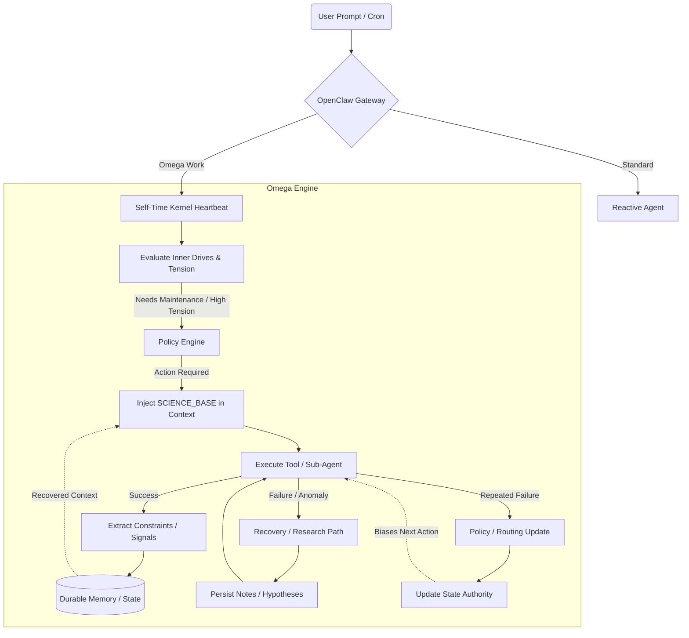

# OpenSkyNet 🤖


_Read this in [Spanish (Español)](README.es.md)._

**OpenSkyNet** is the scientific and practical evolution of [OpenClaw](https://github.com/openclaw/openclaw).

Unlike generic "chat with tools" agents, OpenSkyNet focuses on **real, long-term autonomy, causal reasoning, and empirical validation** of AI systems. It is designed to be a robust engineering and scientific assistant that thinks beyond single conversational turns.

## Official Repository

Active development and issues are tracked at:
[github.com/skynet-omega/openskynet](https://github.com/skynet-omega/openskynet)

---

## 🚀 Key Differences from OpenClaw

While **OpenClaw** is a general-purpose framework for routing, tools, and multi-agent execution, **OpenSkyNet** is a more opinionated stack built around empirical continuity, recovery, and long-horizon assistant behavior. It introduces the **Omega** layer as a practical attempt to move beyond one-shot "chat with tools":

- **Biological Framing**: Some Omega components borrow concepts like tension, decay, and bounded energy as control metaphors for autonomous work.
- **Persistent Session Context**: The system keeps more durable task/context state than a plain ephemeral chat loop.
- **Policy and Recovery Paths**: Omega can react to repeated failures with explicit recovery and rerouting logic instead of always stopping at first error.
- **Empirical Memory Direction**: The repo is moving toward reusable learned constraints and durable state, rather than only retrieving old text.
- **Autonomy Hooks**: Heartbeat, cron, and executive-state mechanisms allow work to continue outside a single user turn.

### OpenSkyNet Empirical Architecture

The following diagram is a **high-level sketch** of the Omega direction in this repository. It is not a formal source of truth for every runtime path; for exact behavior, inspect `src/omega`, tests, and current architecture notes.



---

## 🛠️ Installation

OpenSkyNet requires **Node.js 22+** and **pnpm**.

```bash
# Clone the repository
git clone https://github.com/skynet-omega/openskynet.git

# Navigate to the project folder
cd openskynet

# Install dependencies using pnpm
pnpm install

# Build the project
pnpm build
```

## 🖥️ Running OpenSkyNet

For a standard graphical experience during development, start the gateway and UI in two separate terminals:

**Terminal 1 (Backend Gateway):**

```bash
pnpm gateway:dev
```

**Terminal 2 (Frontend UI):**

```bash
pnpm ui:dev
```

### Terminal UI

OpenSkyNet also includes a Terminal UI for local monitoring and interaction:

```bash
pnpm tui
```

_Note: review your model/auth setup before first run (for example Gemini CLI OAuth, OpenAI Codex OAuth, or local Ollama models)._

---

## 📚 Acknowledgments & Documentation

- **Author**: Gonzalo Daroch I.
- For deep-dive architectural decisions, check the `docs/architecture` and `docs/history` folders.
- Special thanks to **[OpenClaw](https://openclaw.ai/)** for providing the fundamental plumbing and robust multi-agent architecture this project is built upon.

_OpenSkyNet: Turn ambiguous ideas into tested, useful, reproducible progress._
