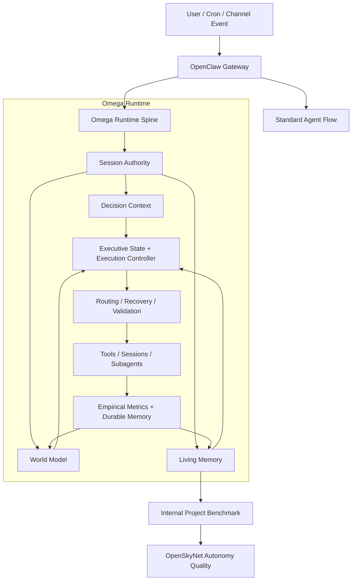

# OpenSkyNet


_Read this in [Spanish (Español)](README.es.md)._

**OpenSkyNet** is an empirical, autonomy-focused evolution of [OpenClaw](https://github.com/openclaw/openclaw).

It is not positioned as a generic "chat with tools" shell. The core goal is to turn an assistant runtime into something more robust across sessions: better state continuity, better recovery after failure, better routing, and better long-horizon autonomous work.

## Repository

Active development happens at:
[github.com/skynet-omega/openskynet](https://github.com/skynet-omega/openskynet)

## Current Direction

OpenSkyNet now has three clearly separated layers:

- **Gateway / agent platform**: channels, sessions, tools, cron, UI, and the operational shell inherited from OpenClaw.
- **Omega runtime**: the main experimental spine for decision context, recovery, routing, executive dispatch, world modeling, and structured memory.
- **Internal project benchmark**: a configurable autonomous background project defined by [INTERNAL_PROJECT.json](/home/daroch/openskynet/INTERNAL_PROJECT.json). By default that project is `Skynet`, but it is not the identity of OpenSkyNet and can be replaced by another domain.

The practical benchmark is simple:

- if OpenSkyNet can sustain useful autonomous work on an internal project over time, it is becoming a better agent than the parent runtime
- if it cannot, the architecture still needs work

## What Is Different From OpenClaw

OpenClaw is the parent platform and still provides essential plumbing. OpenSkyNet diverges where it matters:

- **Structured living memory**: present state is no longer supposed to come from plain text diaries alone. Runtime state lives in `.openskynet/living-memory/` and related structured stores.
- **Runtime sovereignty**: `heartbeat`, `omega_work`, and autonomous execution are moving toward a shared runtime authority instead of rebuilding context independently.
- **Decision + recovery emphasis**: Omega explicitly models recovery paths, routing preferences, world state, and maintenance pressure.
- **Bifurcation Engine + Research Harvesting**: Skynet now employs parallel decision paths (bifurcation) and autonomous artifact collection (harvesting) to ensure research continuity even across model failures.
- **Internal benchmark workload**: the system can work on a configurable internal project during free cycles, and that workload doubles as an empirical benchmark of autonomy quality.
- **Empirical posture**: the repo tries to keep architecture tied to tests, state snapshots, logs, and benchmarkable behavior rather than pure narrative.

## Architecture Snapshot

This is a simplified map of the current runtime shape. It is a guide, not a legal source of truth. For exact behavior, inspect [src/omega](/home/daroch/openskynet/src/omega), [src/skynet](/home/daroch/openskynet/src/skynet), tests, and `docs/architecture/`.



## Installation

Requirements:

- Node.js `22+`
- `pnpm`

```bash
git clone https://github.com/skynet-omega/openskynet.git
cd openskynet
pnpm install
pnpm build
```

## Running

Development:

```bash
pnpm gateway:dev
pnpm ui:dev
```

Terminal UI:

```bash
pnpm tui
```

Production-style local build:

```bash
pnpm build
openskynet daemon restart
```

## Internal Project Benchmark

OpenSkyNet can keep a configurable internal project as background autonomous work. The default file is [INTERNAL_PROJECT.json](/home/daroch/openskynet/INTERNAL_PROJECT.json).

That project can be:

- AI research
- protein design
- architecture design
- any other long-running workload the user wants

By default this repository uses `Skynet` as that benchmark project, but the platform should not depend on that name to remain useful.

## Observability

Important operational references:

- [docs/OPERABILIDAD_Y_LOGS.md](/home/daroch/openskynet/docs/OPERABILIDAD_Y_LOGS.md)
- `.openskynet/living-memory/`
- `~/.openskynet/agents/*/sessions/`
- `~/.openskynet/cron/`
- `/tmp/openclaw/openclaw-YYYY-MM-DD.log`

## Project Status

The repo is beyond the original "chatbot with tools" baseline, but it is not finished. The current critical work is no longer cosmetic cleanup; it is:

- consolidating runtime sovereignty in Omega
- improving autonomous decision quality
- tightening memory authority
- measuring whether OpenSkyNet actually outperforms OpenClaw on long-horizon autonomous work

See:

- [docs/architecture/LIMITACIONES_CRITICAS_OPENSKYNET_2026-03-26.md](/home/daroch/openskynet/docs/architecture/LIMITACIONES_CRITICAS_OPENSKYNET_2026-03-26.md)
- [docs/architecture/OPENCLAW_VS_OPENSKYNET_2026-03-26.md](/home/daroch/openskynet/docs/architecture/OPENCLAW_VS_OPENSKYNET_2026-03-26.md)

## Acknowledgments

- Author: Gonzalo Daroch I.
- Parent platform: [OpenClaw](https://openclaw.ai/)

OpenSkyNet exists to move from reactive assistance toward measurable autonomous scientific and engineering work.
