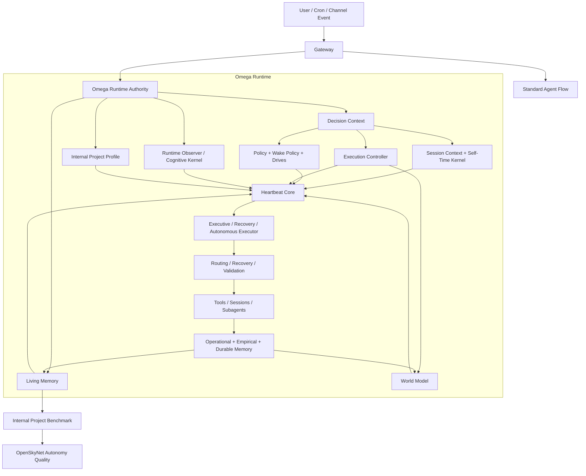

# OpenSkyNet


_Read this in [Spanish (Español)](README.es.md)._

**OpenSkyNet** is an empirical, autonomy-focused evolution of [OpenClaw](https://github.com/openclaw/openclaw).

It is not positioned as a generic "chat with tools" shell. The core goal is to turn an assistant runtime into something more robust across sessions: better state continuity, better recovery after failure, better routing, and better long-horizon autonomous work.

## Experimental Status

This repository is **experimental**.

It is intended for:

- frontier functionality
- autonomy research
- runtime experimentation
- Brain Lab exploration under [`src/skynet`](./src/skynet)

It is **not** positioned as a production deployment target.

Practical expectation:

- functionality and empirical iteration take priority over production hardening
- architecture may change aggressively
- experimental subsystems may be incomplete, unstable, or intentionally rough around the edges
- if you deploy it in a sensitive environment, that is your responsibility, not a promise of the project

## Repository

Active development happens at:
[github.com/skynet-omega/openskynet](https://github.com/skynet-omega/openskynet)

Public mirrors and contact:

- GitHub: [github.com/skynet-omega/openskynet](https://github.com/skynet-omega/openskynet)
- Hugging Face mirror: [huggingface.co/Darochin/openskynet](https://huggingface.co/Darochin/openskynet)
- Contact: [gonzalo_daroch@hotmail.com](mailto:gonzalo_daroch@hotmail.com)

## Current Direction

OpenSkyNet should be read as two explicit lines of work:

- **OpenSkyNet**: the platform itself. This includes the gateway, sessions, tools, channels, cron, UI, and the `Omega` runtime spine for memory, routing, recovery, and executive control.
- **Skynet Brain Lab**: the separate research line under [`src/skynet`](./src/skynet) for searching a new cognitive substrate beyond a plain LLM-centric agent.

There is also a configurable autonomous benchmark workload defined by [`INTERNAL_PROJECT.json`](./INTERNAL_PROJECT.json). By default that workload is `Skynet`, but that file is a benchmark target for the platform, not the identity of the whole repository.

Practical rule:

- if the goal is runtime quality, autonomy quality, recovery, observability, or lower waste, work in `OpenSkyNet`
- if the goal is a new brain, new substrate, geometric quantization, biphasic/cyborg cognition, or a generalist architecture beyond the current stack, work in `Skynet Brain Lab`
- only promote mechanisms from the lab into the platform after empirical validation and explicit cost/benefit review

Current repo priority:

- `OpenSkyNet` is stable enough that new architectural work should mostly pause there
- only operational continuity / reliability bugs should justify touching the platform now
- active exploration should move to `Skynet Brain Lab`

Operationally, the repo is still handled under a two-line directive:

- `OpenSkyNet` = platform/runtime/tooling
- `Skynet Brain Lab` = the separate research line under [`src/skynet`](./src/skynet) for searching a new cognitive substrate beyond a plain LLM-centric agent
- promote mechanisms from the lab into the platform only after empirical validation and explicit cost/benefit review

The practical benchmark is simple:

- if OpenSkyNet can sustain useful autonomous work on an internal project over time, it is becoming a better agent than the parent runtime
- if it cannot, the architecture still needs work

## Omega Today

`Omega` is no longer just a name for vague cognition experiments. It already has concrete runtime responsibilities under [`src/omega`](./src/omega):

- [`runtime-authority.ts`](./src/omega/runtime-authority.ts): merges present-state signals into a shared runtime authority used by heartbeat, executive work, and autonomy.
- [`living-memory.ts`](./src/omega/living-memory.ts) and [`living-memory-events.ts`](./src/omega/living-memory-events.ts): maintain structured present state plus a durable event history under `.openskynet/living-memory/`.
- [`world-model.ts`](./src/omega/world-model.ts): derives routing pressure, locality, recovery preference, internal-project pressure, and executive context from current runtime state.
- [`session-context.ts`](./src/omega/session-context.ts): keeps timeline, validation, self-time kernel, and session outcome state coherent across turns.
- [`execution-controller.ts`](./src/omega/execution-controller.ts): chooses corrective control and recovery posture instead of leaving failure handling as ad hoc prompt glue.
- [`heartbeat-core.ts`](./src/omega/heartbeat-core.ts): centralizes wake reasoning, runtime authority loading, corrective framing, and executive wake logic.
- [`frontal/wake-policy.ts`](./src/omega/frontal/wake-policy.ts): prioritizes interrupted or active work above stale-goal cleanup.
- [`inner-life/drives.ts`](./src/omega/inner-life/drives.ts): resolves persistent motivational pressure with contextual drive selection instead of raw error ranking.
- [`sparse-metabolism.ts`](./src/omega/sparse-metabolism.ts) and [`jepa-drive-enhancement.ts`](./src/omega/jepa-drive-enhancement.ts): add lighter-weight surprise-aware gating so expensive components wake up more selectively.
- [`cognitive-kernel.ts`](./src/omega/cognitive-kernel.ts): loads a lab artifact only as a gated soft prior, not as a sovereign replacement for the runtime.

Recent work also pushed non-critical or still-theoretical pieces out of the hot path into [`src/omega/experimental`](./src/omega/experimental), so the platform runtime is clearer than earlier iterations.

## What `src/skynet/experiments` Is For

[`src/skynet/experiments`](./src/skynet/experiments) is the active laboratory of **Skynet Brain Lab**.

Its purpose is not to decorate the platform with speculative code. It exists to:

- test new cognitive substrates, non-traditional architectures, and physical/geometric hypotheses outside the stable runtime
- run falsifiable benchmarks before promoting any mechanism into `OpenSkyNet` or `Omega`
- preserve historical architecture lines such as `V28`, `V67`, `V77`, and related prototypes without forcing them into production
- separate two questions cleanly:
  - "does this idea create a better brain?"
  - "does this idea improve the production runtime?"

Practical rule:

- if an experiment stays in `src/skynet/experiments`, it is still research
- if a mechanism survives empirical review and explicit cost/benefit analysis, only then should it be transferred into the platform

## What Is Different From OpenClaw

OpenClaw is the parent platform and still provides essential plumbing. OpenSkyNet diverges where it matters:

- **Structured living memory**: present state is no longer supposed to come from plain text diaries alone. Runtime state lives in `.openskynet/living-memory/` and related structured stores.
- **Runtime sovereignty**: `heartbeat`, `omega_work`, and autonomous execution are moving toward a shared runtime authority instead of rebuilding context independently.
- **Decision + recovery emphasis**: Omega explicitly models recovery paths, routing preferences, world state, and maintenance pressure.
- **Concrete Omega spine**: living memory, world model, wake policy, drive resolution, metabolism, corrective control, and executive recovery are now implemented as explicit modules rather than one large conversational blob.
- **Internal project research line**: the `Skynet` benchmark/lab line includes bifurcation-style probes, causal episode harvesting, and other experimental loops without making them mandatory for the core platform runtime.
- **Internal benchmark workload**: the system can work on a configurable internal project during free cycles, and that workload doubles as an empirical benchmark of autonomy quality.
- **Empirical posture**: the repo tries to keep architecture tied to tests, state snapshots, logs, and benchmarkable behavior rather than pure narrative.

## Architecture Snapshot

This is a simplified map of the current runtime shape. It is a guide, not a legal source of truth. The important correction versus older diagrams is that `Omega` is no longer just "Decision Context -> World Model -> Execution". The practical spine now runs through `runtime-authority`, `decision-context`, `policy`, `living-memory`, `world-model`, `execution-controller`, and `heartbeat-core`.

For exact behavior, inspect [`src/omega`](./src/omega), [`src/skynet`](./src/skynet), tests, and `docs/architecture/`.



## Installation

Requirements:

- Node.js `22+`
- `pnpm`

Clone from GitHub:

```bash
git clone https://github.com/skynet-omega/openskynet.git
cd openskynet
pnpm install
pnpm build
```

Or clone from the Hugging Face mirror:

```bash
git clone https://huggingface.co/Darochin/openskynet
cd openskynet
pnpm install
pnpm build
```

Notes:

- A clean install works on Node `22.22.1+` and `pnpm 10.23.0+`.
- The GitHub repository is the primary development remote. The Hugging Face repository is a public mirror for download and backup.
- Some optional native integrations use `pnpm approve-builds` on fresh installs. If you plan to use GPU TensorFlow, native audio, or other native add-ons, run:

```bash
pnpm approve-builds
```

- Core CLI, gateway, UI, sessions, channels, and the standard agent flow install and build without extra manual patching.

## First Useful Run

Minimal local bootstrap:

```bash
pnpm install
pnpm build
./openskynet.mjs setup
./openskynet.mjs configure
./openskynet.mjs dashboard --no-open
```

After that you can choose one of these normal entrypoints:

- `pnpm gateway:dev` for local development
- `pnpm tui` for the terminal UI
- `./openskynet.mjs agent ...` for direct CLI agent runs
- `./openskynet.mjs daemon restart` after a production-style build

If you want a slightly longer install/run path, see [`docs/start/QUICKSTART.md`](./docs/start/QUICKSTART.md).

## Running

Development:

```bash
pnpm gateway:dev
pnpm ui:dev
```

Terminal UI:

```bash
pnpm tui
```

Production-style local build:

```bash
pnpm build
openskynet daemon restart
```

## Internal Project Benchmark

OpenSkyNet can keep a configurable internal project as background autonomous work. The default file is [`INTERNAL_PROJECT.json`](./INTERNAL_PROJECT.json).

That project can be:

- AI research
- protein design
- architecture design
- any other long-running workload the user wants

By default this repository uses `Skynet` as that benchmark project, but the platform should not depend on that name to remain useful.
The benchmark can help measure whether the platform is getting better, but it should not collapse the distinction between `OpenSkyNet` and `Skynet Brain Lab`.

## Observability

Important operational references:

- [`docs/OPERABILIDAD_Y_LOGS.md`](./docs/OPERABILIDAD_Y_LOGS.md)
- `.openskynet/living-memory/`
- `~/.openskynet/agents/*/sessions/`
- `~/.openskynet/cron/`
- `/tmp/openclaw/openclaw-YYYY-MM-DD.log`

## Project Status

The repo is beyond the original "chatbot with tools" baseline, but it is not finished. The current critical work is no longer cosmetic cleanup; it is:

- consolidating runtime sovereignty in Omega
- improving autonomous decision quality
- tightening memory authority
- measuring whether OpenSkyNet actually outperforms OpenClaw on long-horizon autonomous work

See:

- [`docs/architecture/LIMITACIONES_CRITICAS_OPENSKYNET_2026-03-26.md`](./docs/architecture/LIMITACIONES_CRITICAS_OPENSKYNET_2026-03-26.md)
- [`docs/architecture/OPENCLAW_VS_OPENSKYNET_2026-03-26.md`](./docs/architecture/OPENCLAW_VS_OPENSKYNET_2026-03-26.md)

## What To Expect As A New User

OpenSkyNet is shareable now, but it is still a technical project:

- Installation and build are straightforward for Node/pnpm users.
- The runtime is large and highly configurable; it is not a one-command toy agent.
- Some documentation and internal references still reflect the parent platform lineage.
- Experimental `Omega` and `Skynet` subsystems are included, but you can use the platform without enabling every experimental path.

If your goal is to evaluate the platform, start with the gateway, dashboard, TUI, and one channel. Add GPU, TTS, browser control, or experimental cognition only when you actually need them.

## Support And Mirrors

If you want the canonical development history, issues, and code review flow, use GitHub:

- [github.com/skynet-omega/openskynet](https://github.com/skynet-omega/openskynet)

If you want a public mirror for direct download or archival, use Hugging Face:

- [huggingface.co/Darochin/openskynet](https://huggingface.co/Darochin/openskynet)

For direct contact:

- [gonzalo_daroch@hotmail.com](mailto:gonzalo_daroch@hotmail.com)

## Acknowledgments

- Author: Gonzalo Daroch I.
- Parent platform: [OpenClaw](https://openclaw.ai/)

OpenSkyNet exists to move from reactive assistance toward measurable autonomous scientific and engineering work.
